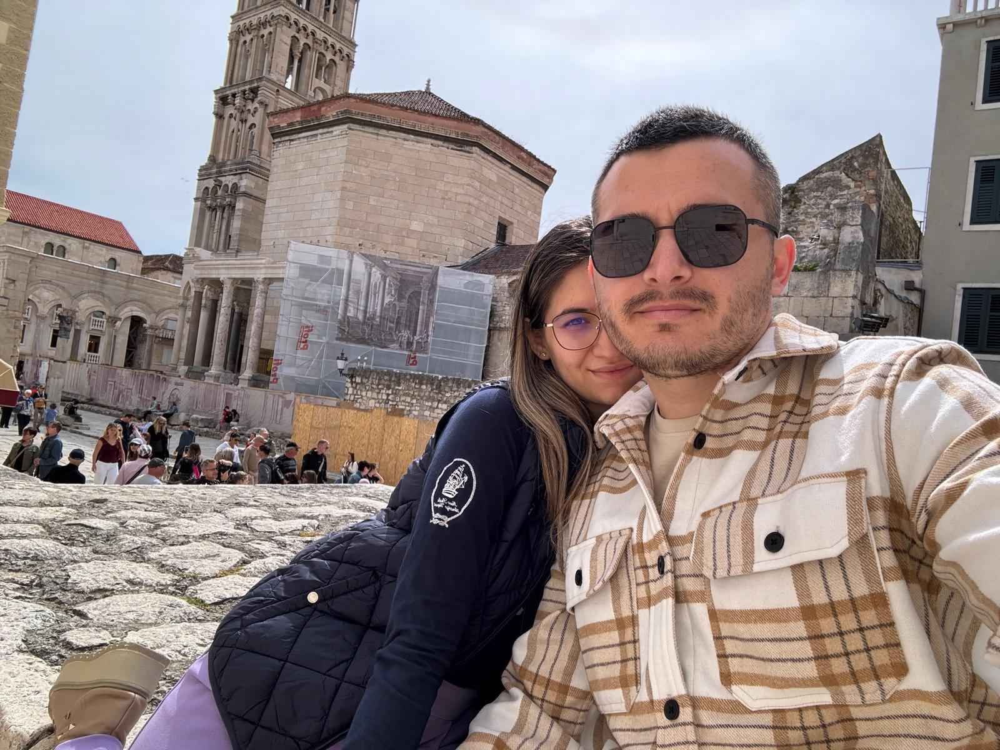

<!DOCTYPE html>
<html lang="ro">
<head>
<meta charset="UTF-8">
<title>Pentru tine 💖</title>

</head>

<body>

<h1 id="text">Vrei să ne împăcăm și să fii zâna mea? 🧚‍♀️</h1>

<button id="yes" onclick="yesClick()">DA 💖</button>
<button id="no" onclick="noClick()">NU 😈</button>

<audio id="music" loop>
  <source src="https://www.bensound.com/bensound-music/bensound-romantic.mp3" type="audio/mpeg">
</audio>

</body>
</html>
